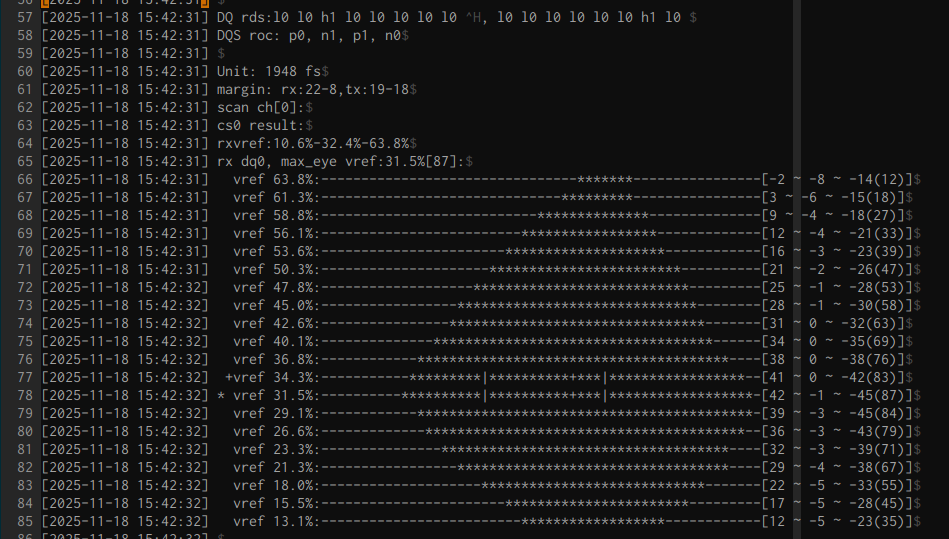

MEMORY_VERIFY
====

<br/>
<br/>
<br/>
<br/>
<hr>

# Bootloade 단계 DDR Init / Eye Training 검증
 - 부트로더(SPL/U-Boot) DDR(메모리)를 가장 먼저 초기화 코드.  
 - 이 단계에서 DDR Timing 이 맞지 않으면,  
   * 부팅 자체 불가능.  
   * 무한 부팅 루프 발생.  
   * 메모리 Read/Write 오류 발생  


 - 주요 작업
   * DDR Init
     메모리 종류, 용량, Bank, Row/Column 구조 설정  
     타이밍 파라미터(tRCD, tRP, tRFC 등) 설정  
     ODT (On Die Termination), Drive Strength 설정  
   * Eye Training / Eye Diagram
     Rockchip SPL은 DDR 신호 시점을 자동으로 보정하는 Training을 수행  
     + Read/Write 레벨링  
     + DQS-DQ 타이밍 보정  
     + 트레이닝 결과(Eye Margin) 확보  
     > DDR 은 수 GHz로 동작하기 때문에, 불확실성을 피하려면, "Read/Write 타이밍의 안정성(Eye Margin)" 확보 필요.  

<br/>
<br/>
<br/>
<hr>

## DDR Training

 DDR 메모리가 부팅 시 정상적인 Read/Wrine 동작을 위해 컨트롤러가 '신호 시점(Timing)'을 자동으로 조정하는 과정.  
 즉, 메모리 컨트롤러(MC) 가 DRAM의 신호 타이밍.전기적 조건을 측정하고 보정하는 자동 보정(calibration)절차.  

 - DDR Training이 필요한 이유. 
 DDR은 매우 높은 속도로 동작(DDR4 2133MHz) (실제 내부 동작은 1ns 이하 수준)  

   * DQS(데이터 스트로브)와 DQ(데이터) 신호가 정확히 맞아야 읽기/쓰기 가능.  
   * PCB routing 길이 차이.  
   * 온도 변화에 따른 전기적 지연 증가  
   * 제조 편차(각 DRAM 칩, 각 보드 마다 차이 잇음)  
   * ODT/drive strength 오차  
 
 이런 변수들 때문에 **이론적 타이밍만으로는 정확한 Read/Write 위치를 맞출수 없다.** 
 그래서 부팅 시, **트레이닝 자동 보정** 필요함  
  
  
 - DDR Training 중, 수행되는 보정 작업.  

   * Write Leveling   
     + 컨트롤러가 데이터를 보낼 때(DQ)과 DQS(쓰기 클럭) 사이의 관계를 맞춤.
     + DRAM은 내부적으로 비동기 구조 → DQS가 너무 빠르거나 느리면 메모리가 기록을 못함.
     + Write leveling은 DRAM이 ACK를 보낼 수 있을 때까지 DQS 타이밍을 조정하는 과정.

   * Read Gate Training  
     + DRAM이 데이터를 보낼 때, DQS를 정확한 타이밍에 잡아내는 과정

   * Read/Write Data Eye Training  
     + Delay를 좌→우로 조정해가며  
     + 데이터를 읽거나 쓰면서  
     + 어느 지점에서 FAIL/OK가 발생하는지 측정한다.  

   * Vref Training (Voltage Reference)  
     + DDR4/LPDDR4 는 내부 reference voltage 에 매우 민감.  

<br/>
<br/>
<br/>
<br/>
<hr>

# LPDDR4 Memory Interface 구조 개요  

 LPDDR4의 데이터 신호는 다음과 같이 구성  

 - **DQ (Data I/O)**  
   * 실제 데이터(bit)를 전송하는 선  
   * 1개 DQ = 1bit  
   * 보통 8개 DQ 를 하나의 Byte Lane으로 묶음  
    (예: DQ0~DQ7 = Byte0)  

 - **DQS (Data Strobe)**  
   * DQS는 "데이터 전송 시점을 표시하는 클럭 역할"  
   * DDR(Double Data Rate) 은 **상승.하강 에지 모두에서 데이터 전송**  
   * 이를 맞추기 위해 메모리 컨트롤러(MC) 가 DQS 신호의 에지를 기준으로 DQ를 정확히 샘플링  
 
 - **DMI / DM (Data Mask / Data Invert)**
   * LPDDR4는 DMI(Data Bus Inversion) 기능으로 사용  

 - Address/Command (A0~A5, CKP/N, CS, CKE 등)  
   * 주소/명령을 전달하는 Command Bus

 Byte Lane 구성 방식(LPDDR4)  

 즉, 16bit 데이터는 아래 2개의 Byte Lane으로 구성  
```
Byte Lane 0
 ├── DQ0~DQ7 (8bit)
 ├── DQS0P / DQS0N (Differential Strobe)
 └── DMI0 (DBI)

Byte Lane 1
 ├── DQ8~DQ15 (8bit)
 ├── DQS1P / DQS1N
 └── DMI1

```

<br/>
<br/>
<br/>
<br/>
<hr>

# Eye Pattern 구성 요소



 각 행은 다음을 의미함.  

 1) Vref Sweep  
 DDR 컨트롤러는 **RX Vref 값(VrefDQ)을 여러 단계**(예: 13% ~ 63%) 로 변경하면서 각  
 Vref 에서 "DQㅓ 신호가 정상적으로 읽히는 지점" 을 스캔.  
  
 → 이게 왼쪽의 vref xx.x% 컬럼.  

 2) DQS Delay Sweep  
 각 Vref 마다  
 DQS Delay (DQ-DQS Align)를 좌에서 우로 Sweep 한다.  

 → Sweep 동안 오류가 없으면 * 로 표시  
 → 오류가 발생하는 구간은 - 로 표시  

 즉,  
```bash
***************|***************
```

 의미는, 
 - 왼쪽 *************** = DQS Delay를 왼쪽으로 이동해도 정상적으로 읽힘
 - |는 중앙 기준점
 - 오른쪽 *************** = DQS를 오른쪽으로 이동해도 정상 읽힘

 → 이 전체 영역이 바로 Eye Opening 이다.

 3) 우측 숫자  
 예:

```bash
[42  ~  -3 (87)]

```

 구성,  
| 항목                  | 의미                                          |
| --------------------- | --------------------------------------------- |
| **Left Margin = 42**  | DQS Delay를 왼쪽으로 이동해도 정상 읽히는 폭  |
| **Right Margin = -3** | DQS Delay를 오른쪽으로 이동해도 정상 읽히는 폭|
| **Total Width = 87**  | Eye Opening(정상 읽기 가능한 영역 총 폭)      |

 이 수치는 실제 fs 단위가 아니라 ROckchip내부의 **스텝 단위(step index)**. 

   
✔ 정리 – 업계에서 해석하는 방식 그대로 설명
  
 - Channel 0, CS0에 대해 DDR 컨트롤러가 Vref값을 바꾸어가며 RX 타이밍 품질을 평가  
 - 각 Vref에서 DQS Delay를 좌→우로 Sweep하면서 정상/오류 영역을 ASCII로 표시  
 - 가운데가 넓게 열리면 좋은 신호  
 - max_eye vref는 가장 안정적인 Vref 포인트  
 - 우측의 [Left ~ Right (Total)]은 Eye Margin(눈 크기)을 나타내는 핵심 수치  


<br/>
<br/>
<br/>
<br/>
<hr>

# ETC 

 - DQ : 
 - DQS : 
 - Vref : Reference Voltage, 참조 전압. 메모리 컨트롤러가 DQ데이터를 '0/1' 으로 판단하기 위한 기준 전압.   
  DQ 신호가 Vref보다 높으면 → ‘1’  
  DQ 신호가 Vref보다 낮으면 → ‘0’  
  으로 판별하도록 정의된 논리 판단 기준점  
 - ttot10/ttot16 : Training 수행 로그에서 발생된 문자열이고, Training 절차가 진행되었음을 나타내는 문자열.  

<br/>
<br/>
<br/>
<br/>
<hr>

# RK3568 vs RK3576 RAM Usage Map Report 


