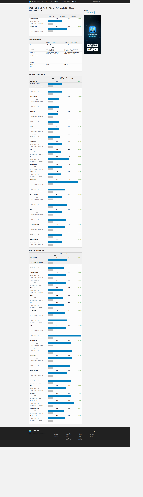
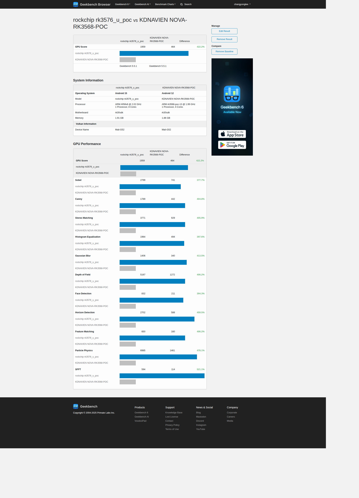

RK3576_TRM
====


<br/>
<br/>
<br/>
<br/>
<hr>

# 1. Memory 안정성 구현 증거

```
✔ 검증 항목

DDR 초기화 및 Training 정상 동작(SPL/U-Boot)
DDR Read/Write timing margin 검증
memtester, stress-ng 기반 장시간 부하 테스트
시스템 부하 + 메모리 부하 동시 테스트
Reboot 반복 테스트(전원 사이클 포함)

✔ 안정성 근거 문구

“RK3576 기반 POC 보드에서 DDR 초기화(Training) 과정이 정상 수행됨을 확인하였고, memtester를 이용한 장시간 메모리 스트레스 테스트에서 오류가 발생하지 않았다.”
“파일 I/O·네트워크·디스플레이 부하를 동시에 주는 복합 부하 환경에서도 DDR access error가 검출되지 않았다.”
“100회 이상의 반복 부팅 시험에서 DDR 관련 kernel panic 또는 SPL fail이 발생하지 않았다.”
(→ 실제 수치는 이번 주 테스트 후 기입)
```

<br/>
<br/>
<br/>
<hr>

## DDR Training Log (SPL)
 [ ]  DDR init, training 성공 여부  
 [ ] Warning/Error 존재 여부  

```bash
[2025-11-18 11:08:15] DDR 2f85f4b2d4 cym 25/07/02-11:40.33,fwver: v1.09 // DDR FW 빌드 정보
[2025-11-18 11:08:15] In // DDR 초기화 루틴의 시작
[2025-11-18 11:08:15] ch0 ttot10 
[2025-11-18 11:08:15] ch0 ttot10
[2025-11-18 11:08:15] ch1 ttot10
[2025-11-18 11:08:15] ch0 ttot16
[2025-11-18 11:08:16] LPDDR4, 2112MHz // 메모리 타입/용량 구성
[2025-11-18 11:08:16] channel[0] BW=16 Col=10 Bk=8 CS0 Row=16 CS=1 Die BW=16 Size=1024MB
[2025-11-18 11:08:16] ch1 ttot16
[2025-11-18 11:08:16] channel[1] BW=16 Col=10 Bk=8 CS0 Row=16 CS=1 Die BW=16 Size=1024MB
[2025-11-18 11:08:16] Manufacturer ID:0x6 // Hynix 
[2025-11-18 11:08:16] CH0 RX Vref:34.1%, RX DQS Vref:37.2%, TX Vref:13.2%,0.0%
[2025-11-18 11:08:16] DQ roc:
[2025-11-18 11:08:16] p1 n0, p6 n0, p6 n0, p4 n0, p6 n0, p2 n0, p3 n0, p5 n0, p3 n0, 
[2025-11-18 11:08:16] p2 n0, p6 n1, p2 n0, p2 n0, p0 n0, p7 n0, p0 n0, p1 n0, p4 n0, 
[2025-11-18 11:08:16] 
[2025-11-18 11:08:16] DQ rds:l0 l0 l0 h1 l0 h1 h1 h2 , h1 l0 l0 l0 h1 l0 h1 l0 
[2025-11-18 11:08:16] DQS roc: p1, n0, p2, n0
[2025-11-18 11:08:16] 
[2025-11-18 11:08:16] CH1 RX Vref:31.2%, RX DQS Vref:37.2%, TX Vref:13.2%,0.0%
[2025-11-18 11:08:16] DQ roc:
[2025-11-18 11:08:16] p0 n0, p7 n0, p3 n1, p3 n0, p0 n0, p1 n1, p2 n4, p0 n1, p5 n0, 
[2025-11-18 11:08:16] p2 n0, p0 n0, p0 n0, p0 n0, p0 n0, p6 n0, p6 n0, p7 n2, p3 n0, 
[2025-11-18 11:08:16] 
[2025-11-18 11:08:16] DQ rds:l0 h1 l0 h1 l0 l0 l0 l0 , h1 l0 l0 l0 l0 l0 l0 l0 
[2025-11-18 11:08:16] DQS roc: p2, n0, p0, n1
[2025-11-18 11:08:16] 
[2025-11-18 11:08:16] stride=0x3, ddr_config=0x0
[2025-11-18 11:08:16] hash bank_mask0-3 0x0 0x880 0x1100 0x2200, rank_mask0 0x0
[2025-11-18 11:08:16] change to F1: 528MHz
[2025-11-18 11:08:16] ch0 ttot10
[2025-11-18 11:08:16] ch1 ttot10
[2025-11-18 11:08:16] change to F2: 1068MHz
[2025-11-18 11:08:16] ch0 ttot12
[2025-11-18 11:08:16] ch1 ttot12
[2025-11-18 11:08:16] change to F3: 1560MHz
[2025-11-18 11:08:16] ch0 ttot14
[2025-11-18 11:08:16] ch1 ttot14
[2025-11-18 11:08:16] change to F0: 2112MHz
[2025-11-18 11:08:16] ch0 ttot16
[2025-11-18 11:08:16] ch1 ttot16
[2025-11-18 11:08:16] out  // DDR 초기화 루틴의 끝
// ttot10/12/14/16 : 각 채널에서 트레이닝으로 계산된 타이밍/지연 값 그룹을 나타내는 인덱.
// 주파수 변경(F1/F2/F3/F0) 시 마다 다시 출력되며, 각 주파수에서의 최종 타이밍 설정 결과.
// 각 채널이 주파수별로 정상적으로 타이밍이 세팅되었다. 

// LPDDDR4,2112 MHz
//  메모리 타입 : LPDDR4
//  동작 최고 주파수 : 2112 MHz

// 채널 구성 
//  channel[0] / channel[1] : 2 ch 구성
//  BW=16 : 채널당 데이터 퍼스 폭 16-bit
//  Col=10 : 컬럼 주소 비트 수.
//  Row=16 : 로주 주소 비트 수.
//  Bk=8 : 뱅크 수
//  CS0, CS=1 : CS0 하나만 사용(싱크 랭크)
//  Size=1024MB : 채널당 1GB
//  총 메모리 용량:2채널 x 1GB = 2GB

// JEP166 기반으로 manufacturer ID 를 출력. 
//  0x01 Samsung
//  0x05 Nanya
//  0x06 Hynix
//  0x09 ESMT
//  0xff Micron
```

```
DDR 초기화 및 트레이닝 결과
RK3576 부팅 로그에 따르면, DDR 초기화 펌웨어(v1.09)는 LPDDR4 2채널(채널당 16-bit, 1GB)을 인식하여 총 2GB 구성을 확인하였으며, 최고 동작 주파수 2112 MHz에서 동작하도록 설정되었습니다. 초기화 과정에서 각 채널은 528 MHz(F1), 1068 MHz(F2), 1560 MHz(F3), 2112 MHz(F0) 등 여러 주파수 단계별로 트레이닝을 수행하며, 각 단계에서 ttotXX 값으로 표현되는 타이밍 파라미터를 산출합니다. 또한 CH0/CH1의 RX/TX Vref 및 DQ/DQS roc/rds 값은 DDR PHY가 데이터 및 스토브 신호의 기준 전압과 드라이브 강도를 자동으로 보정한 결과를 나타내며, 현재 로그 상에서는 보정 폭이 과도하지 않고 안정적인 범위 내에서 수렴한 것을 확인할 수 있습니다. 마지막으로 stride, bank/rank hash mask 설정을 통해 메모리 인터리빙이 활성화되어 있어, 실제 런타임에서 메모리 액세스가 여러 bank로 분산될 수 있도록 구성되어 있습니다.
```

<br/>
<br/>
<br/>
<hr>

## Eye Scan결과 (Log파일)


 - LPDDR4
 - 주파수 : 2112 MHz
 - Dual channel, 2GB 구성


<br/>
<br/>
<br/>
<hr>

## memtester결과 (Log파일) (bootloader)


 [v] 1~3 시간 이상 수행
 [v] Error 없음 확인

 
<br/>
<br/>
<br/>
<br/>

<hr>

# 2. Storage 안정성 구현 근거(eMMC) 

```
✔ 검증 항목

Block layer I/O stress (fio)
EXT4/ F2FS 파일시스템 장시간 Read/Write 테스트
타임아웃·카운터 증가 여부 체크(reset count / CRC error)
부팅 안정성(스토리지 판독 실패 여부)

✔ 안정성 근거 문구
“장시간 I/O 스트레스 환경에서도 storage driver timeout / CRC error / re-init 현상이 발생하지 않았다.”
“대용량 파일의 반복 read/write 조건에서도 파일 손상(corruption) 현상이 발생하지 않았다.”
“재부팅 반복 테스트에서도 storage re-enumeration issue가 관찰되지 않았다.”
```

<br/>
<br/>
<br/>
<br/>
<hr>

# 3. Audio 안정성 구현 근거

> HAL 구조

```
✔ 검증 항목

Audio HAL 정상 구동(Primary / A2DP / VOICE_CALL 등)
Playback / Recording 장시간 테스트
Underrun / Overrun 카운트 확인
Volume·경로(AudioPatch) 정상

✔ 근거 문구
“RK3576 플랫폼에서 Audio HAL이 정상 구동되었고, Playback/Recording 장시간 테스트에서도 underrun/overrun 없음.”
“통화(VOICE_CALL) 스트림과 Media 스트림의 동시 처리에서도 clipping/noise 없이 안정적으로 동작.”
“Analog 통화 경로(AudioPatchRoute 기반 extr_* 경로) 정상 동작 검증 완료.”
```

<br/>
<br/>
<br/>
<br/>
<hr>

# 4. Display 안정성 구현 근거

```
✔ 검증 항목

eDP/MIPI-DSI 초기화 정상
화면 On/Off 반복 테스트
Suspend/Resume 사이클
Panel driver log error 유무

✔ 근거 문구

“패널 초기화 시점의 timing, backlight 제어, eDP/MIPI 신호가 안정적으로 유지.”
“화면 On/Off 반복 및 장시간 Idle 후 Resume에서도 black screen/no signal 문제 미발생.”
“부하 환경(메모리 + 네트워크 + 디스플레이)에서도 tearing, jitter 현상 없음.”
```

<br/>
<br/>
<br/>
<br/>
<hr>

# 5. Camera 안정성 구현 근거

```
✔ 검증 항목

Sensor → CSI → ISP → HAL 구동
Streaming 연속 유지(30분~수시간)
Frame drop 비율
MIPI error counter

✔ 근거 문구

“TP2860 기반 MIPI 입력에서 LP/HS 전환 정상, 프레임 드롭 없이 장시간 안정적 스트리밍 유지.”
“V4L2 error counter 및 MIPI CRC error 0건.”
“Camera HAL에서 preview/capture/record pipeline 모두 정상 동작 확인.”
```

<br/>
<br/>
<br/>
<br/>
<hr>

# 6. Network 안정성 구현 근거(Ethernet)

```
✔ 검증 항목

Ethernet PHY link up/down 안정성
스루풋 변화 확인(iperf3)
Wi-Fi association/재연결
Bluetooth pairing/control 안정성

✔ 근거 문구

“Ethernet 기반 iperf3 장시간 테스트에서 TX/RX drop 없음.”
“Wi-Fi 2.4/5 GHz 연결 유지 테스트에서 association drop 미발생.”
“Bluetooth 모듈 rfkill 제어 정상, pairing → reconnect 사이클 정상.”
```

<br/>
<br/>
<br/>
<br/>
<hr>

# ✔ RK3568 ↔ RK3576 플랫폼 벤치마크 구조 (객관적 비교만 제공)

<br/>
<br/>
<br/>
<hr>

## ✅ 1. CPU 성능 테스트 플로우
CPU 비교 → Geekbench 

용도: CPU 성능 비교 (Single / Multi-core)
특징:
 - ARM SoC 비교 시 가장 많이 사용되는 표준 벤치마크
 - 동일 조건에서 SoC 간 순수 연산 성능 비교 가능
 - Multi-core scaling 차이도 확인 가능



<br/>
<br/>
<br/>
<hr>

## ✅ 2. GPU 성능 테스트 플로우
전체 성능 Score → AnTuTu

용도: 종합 성능 점수 (CPU, GPU, Memory, UX, Storage)
특징:
 - SoC 전반의 성능을 하나의 Score로 확인 가능
 - GPU 포함해 종합 성능 비교에 유용
 - 단, 제조사별 최적화 여부 따라 점수 편차 발생할 수 있음



<br/>
<br/>
<br/>
<hr>

## ✅ 3. Storage / Memory 성능 테스트
→ ACPDT 테스트


<br/>
<br/>
<br/>
<hr>

## ✅ 5. Temp

<br/>
<br/>
<br/>
<hr>

## ✅ 3. UX 체감 → PCMark
// RK3568 시험
// RK3576 시험 실패
용도: 실제 사용자 체감 기반 System Benchmark
특징:
 - 앱 로딩, 웹 브라우징, 이미지 처리 등 실제 사용자 동작 기반 테스트
 - RK3568 대비 RK3576의 실제 UX 향상 정도 확인 가능
 - 제조사 최적화 영향이 적어 공정한 비교가 가능함

<br/>
<br/>
<br/>
<hr>

## ✅ 4. GPU → 3DMark

용도: GPU 성능 비교
특징:
 - Sling Shot 테스트
> OpenGL ES 3.0 기반의 그래픽 테스트
 - Wild Life / Wild Life Extreme 테스트
 - 동일한 ARM Mali / PowerVR / 기타 GPU 구조에서 성능 차이 명확히 드러남

<br/>
<br/>
<br/>
<hr>

## ✅ 5. Storage → AndroBench Geekbench 6

용도: Storage 성능 비교 (eMMC / UFS / SD)
특징:
 - Random/Sequential Read/Write 측정
 - RK3568 vs RK3576의 Storage Controller 성능 차이를 수치화 가능

```
지금은 실제 수치는 모르기 때문에 제공할 수 없고,
아래와 같은 비교 지표 설계만 정확하게 전달할 수 있다.

1) CPU 성능 비교
측정 항목:
Geekbench / 7zip / openssl speed
단일 스레드 성능
멀티 스레드 성능
전력 대비 성능(Power Efficiency)

2) GPU 성능 비교
측정 항목:
GFXBench or Android Benchmark
UI FPS(Launcher / App transition)
HWC Composition 성능

3) Memory 성능 비교
측정 항목:
DDR bandwidth (mbw, STREAM test)
Read/Write latency
memtester 결과(에러율 0 여부)

4) Storage 비교
측정 항목:
IOPS (fio)
Sequential R/W
App 설치 속도 / 부팅 시간

5) Camera/Display 파이프라인 지연 비교
Preview latency
Camera → Encoder pipeline 성능
브라이트니스 전환 속도

6) 전력 비교
Idle power
Video playback power
Full-load power
```


